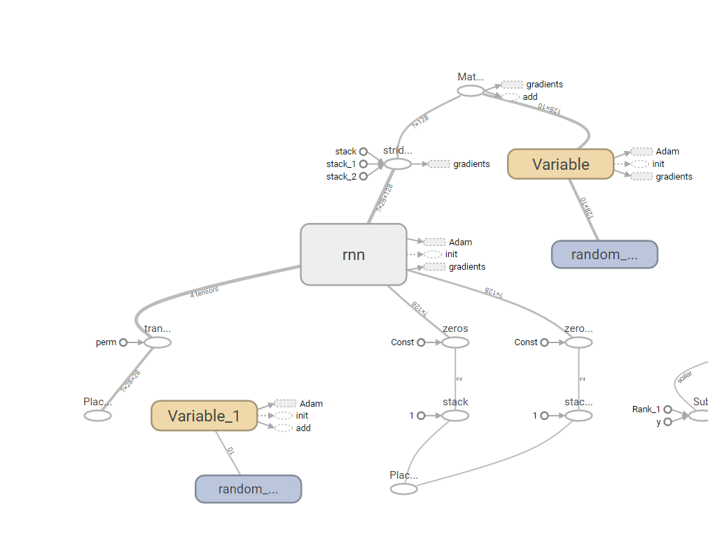
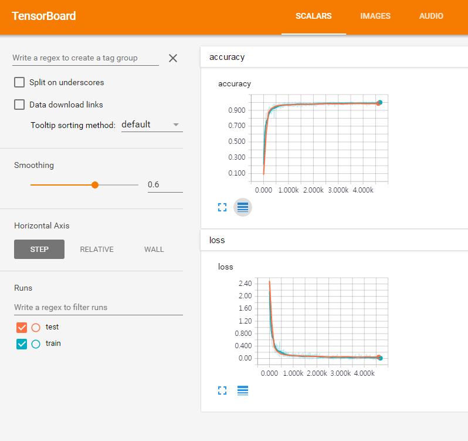

# Implemention LSTM example for MNIST data with Tensorflow

### 1. Dependencies: tensorflow 1.0, etaprogress (sudo pip install tensorflow, tensorflow-gpu(GPU only), etaprogress)
#### - Input: 28 rows of 28x1 fixel vector
#### - Output: 10 classes
### 2. Usage
#### - Training: python mnist_lstm.py
#### - Tensorboard: tensorboard --logdir=/tmp/TF/MNIST

### 3. Result

```shell
$ python mnist_lstm.py

...
Epoch 8/10
100% (468/468) [###################################################] eta 00:00 | | loss: 0.017217 | test_acc: 98.49
Epoch 9/10
100% (468/468) [###################################################] eta 00:00 | | loss: 0.033413 | test_acc: 98.59
Epoch 10/10
100% (468/468) [###################################################] eta 00:01 | | loss: 0.141304 | test_acc: 98.49
Model saved in file: model/tf/lstm/model.ckpt
training time: 128.101911068
predict time: 0.437114953995
accuracy:  98.64
```
### 4. Tensorboard



